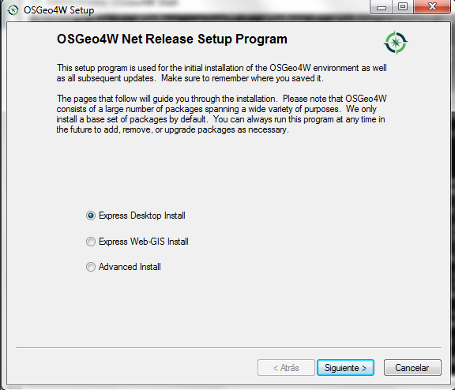
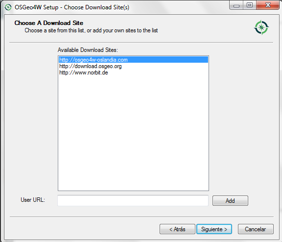
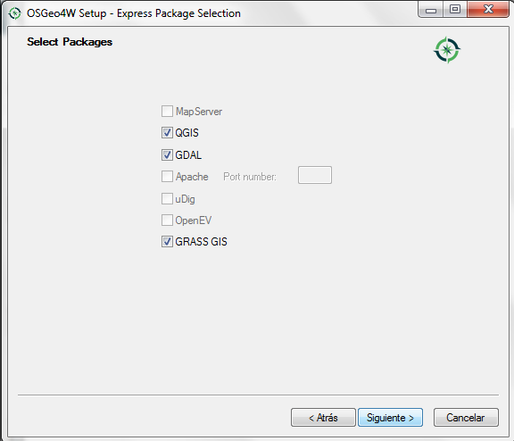

# FloodTool

FloodTool is a very lightweight plug-in for [QGis](https://qgis.org/)
geographical information system. QGis is a very complex piece of free
software with a lot of frameworks that makes the platform very
extensible and, most importantly, we can reuse a lot of available python
code. Extensibility can be achieved by means of algorithms, models and
plug-ins. FloodTool makes extensive use of the three, algorithms to
preprocess layer fields and geometry, models to define workflows of
different algorithms and, finally, the real plug-in to perform the
actual computation of flood level.

This plug-in has been developed under
[MyCOAST](http://www.mycoast-project.org) project.

{#fig:portada width="60%"}

## Requierements

The tool have several prerequisites:

-   **QGIS:** QGIS 3.10 LTR is recommended but the plug-in works from
    3.8 and up. In Windows operating system, it is necessary to install
    it from OSGeo4W.
-   **Python modules**: The plug-in makes extensive use of several
    libraries to perform data access tasks. A recent netCDF4 and cftime.

## Installation

FloodTool is available for Linux and Windows operating systems. We
recommend having a version of QGis 3.8 or higher installed. In Windows
operating system, it is necessary to install a copy of QGis from
OSGeo4W. Installation on Linux operating system is straightforward as
far as all Linux distributions have latest versions of both, software
and libraries.

To install the program under Windows, visit
https://www.qgis.org/es/site/forusers/download.html and choose the
option to download it from OSGeo4W. When executing the "setup" of the
OSGeo4W we must follow these steps:

::: {#fig:OSGeo4W .subfigures}
{#fig:osgeo1}
{#fig:osgeo2}
{#fig:osgeo3}

Figure 2: QGis setup from OSGeo4W.
:::

It is important that you mark, download and install all software
packages that shown in [2 (c)](#fig:osgeo3). Once the packages to be
installed have been selected, they will be downloaded and installed
automatically on our computer. This task will take several minutes
(depending on the network download rate). Once finished, and without
obtaining any warning message, the QGis will be installed on our system.
Next, several dependencies must be satisfied in order Qgis to have
access to OpenDAP data servers. To fulfill the requirements we recommend
the following steps:

-   Open OSGeo4W Shell

-   Path update, using "py3_env."

-   Install "pip" command:

    -   Download "get_pip.py" from <https://bootstrap.pypa.io>
    -   Put he file in OSGeo4W folder and execute from Shell (python
        get_pip.py). This program will download and install pip,
        setuptools and wheel.
    -   Update the paths, again, with "py3_env."

-   From <https://www.lfd.uci.edu/~gohlke/pythonlibs/> download the
    following libraries:

    -   cftime-1.0.4-cp37-cp37m-win_amd64.whl or later.
    -   netCDF4-1.5.3-cp37-cp37m-win_amd64.whl or later

-   Install these packages with pip install package.whl

Once NetCDF and cftime are installed we can install the plug-in itself.
Clone the code tree or download the zip file from this Github
repository. Look for the QGis plug-in folder (in Windows systems usually
C:\\OSGeo4W64\\apps\\qgis\\python\\plugins) and copy the plug-in code to
this location. In QGis program, in tab "Complements/Manage and install
plugins" looking for "FloodTool" and activate it. If you are able to see
a connector icon at the toolbar, congratulations, you have the plug-in
installed.

# Usage

FloodTool plug-in operates over an specific GIS type of vector layer
with several fields and metadata. Several tools (algorithms and models)
are provided to accomplish the task of layer preparation but these tools
are not covered in this document. So, in order to use the plug-in, a
project with input layer is needed. Additional layer, raster or vector,
can be added to the project and you can add symbols as needed as in a
normal QGIS project.

-   To activate the plug-in, find the plug button or select the plug-in
    at the plug-in menu ([3](#fig:interfaz_plugin)). Please, make sure
    you have your input layer is selected. So far, no control over input
    layer is performed and an exception will be raised if selected layer
    is not the right one. The plug-in docked window appears with three
    different tabs:

    -   Layers where kind of output layer is selected
    -   Hydrodynamic where hydrodynamic model is selected
    -   Wave where wave model is selected.

{#fig:interfaz_plugin}

-   The first step is filling in the Hydrodynamic tab selecting the
    hydrodynamic model (Model grid combo box). After model selection,
    calendar is updated accordingly with available files on THREDDS
    server. The attribute of active layer that contains the nearest
    neighbour assignation and netCDF standard_name attribute of variable
    you want to use must also be filled ([4](#fig:hydro_tab)). So far,
    model grids are hard coded into the plug-in. Some hydrodynamic
    models have a tidal solution. This solution can be used to
    synthesize time series of astronomical tide only. If the selected
    model grid has a tidal solution, the check box will be enable. Make
    sure you check it if you want to use it.

{#fig:hydro_tab}

-   Fill in the Wave tab in the same way you filled Hydrodynamic tab.
    Data sources for Hydrodynamic and Wave model can have different time
    spans. The plug-in will select the overlapping time span to perform
    actual calculations. Once hydrodynamic and wave models are
    configured, we need to specify the kind of output we want. So far,
    several options are available ([5](#fig:wave_tab)). Time control
    options indicate if you want to compute Max level or a Timeseries of
    expected flood level. Additionally, you can compute the real level
    or use a "traffic light"-like color codes. For this last option to
    work you will need an input layer with flood level return periods.

{#fig:wave_tab}

-   Once configured, Run button will be enabled. Click on it to start
    with data download, perform calculation of flood level and
    categorization of output. Progress bar will evolve accordingly
    ([6](#fig:resultado)).

{#fig:resultado}

-   After running, and Output vector layer will be created with several
    attributes that can be used to define a QGIS symbols. If you choose
    Timeseries as Time control option, your output vector layer has an
    additional Datetime field called *time* that can be used to animate
    the output with an optional plug-in called Time Manager.
    Installation of this plug-in is very straightforward
    ([7](#fig:timemanager)).

{#fig:timemanager}
